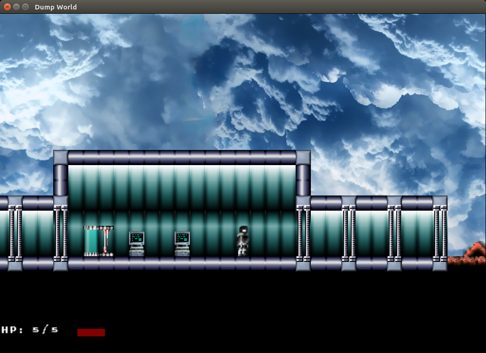
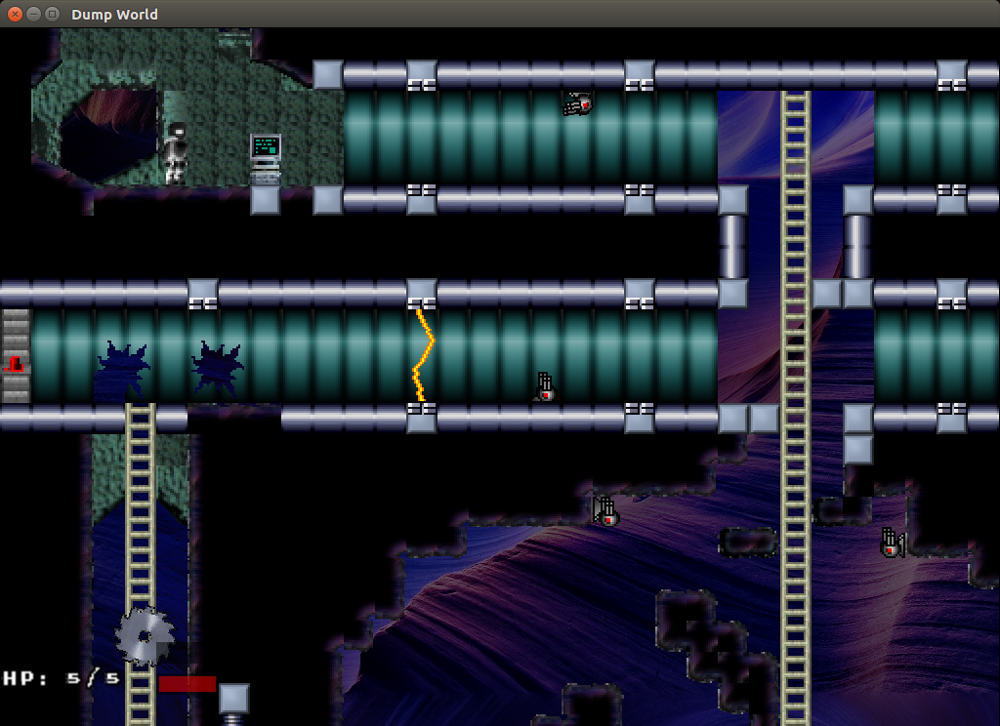
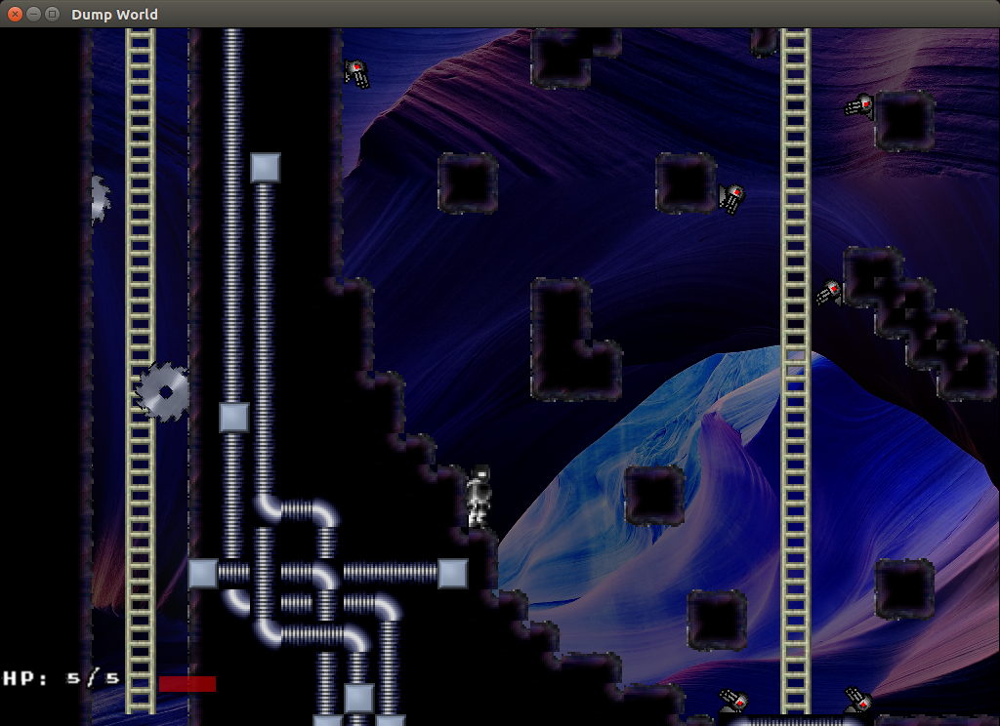
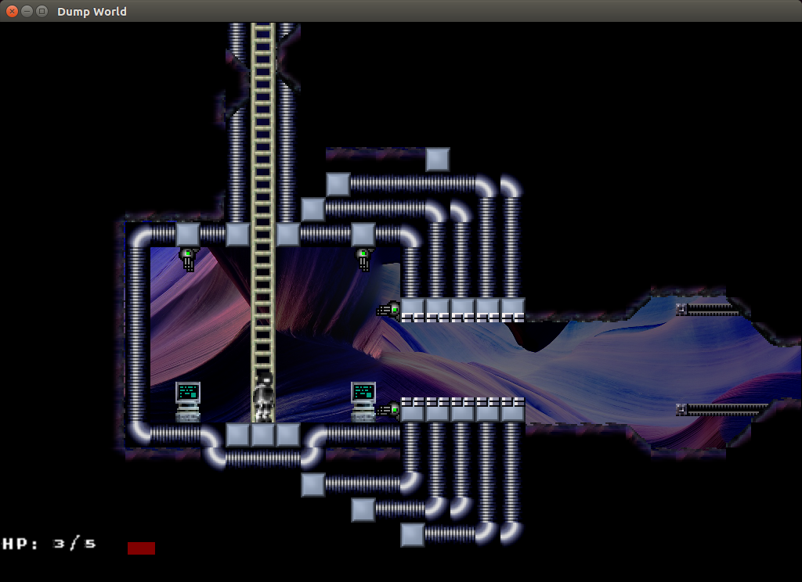
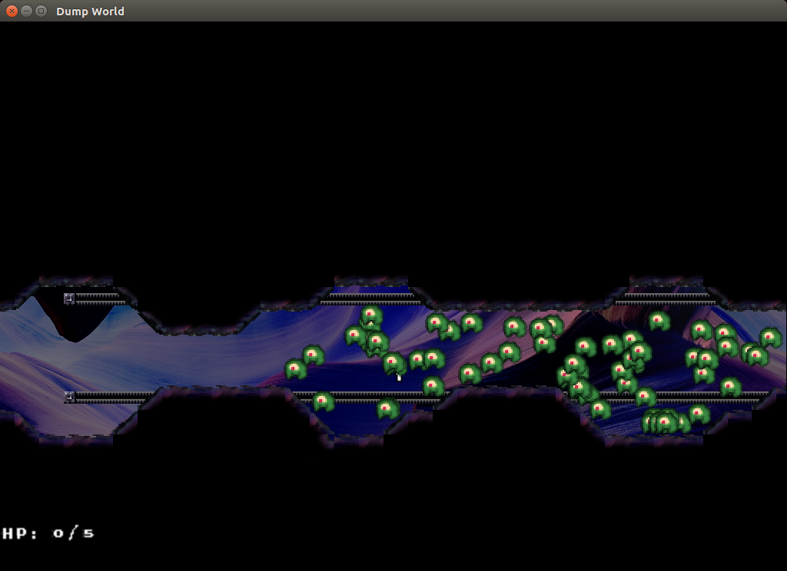
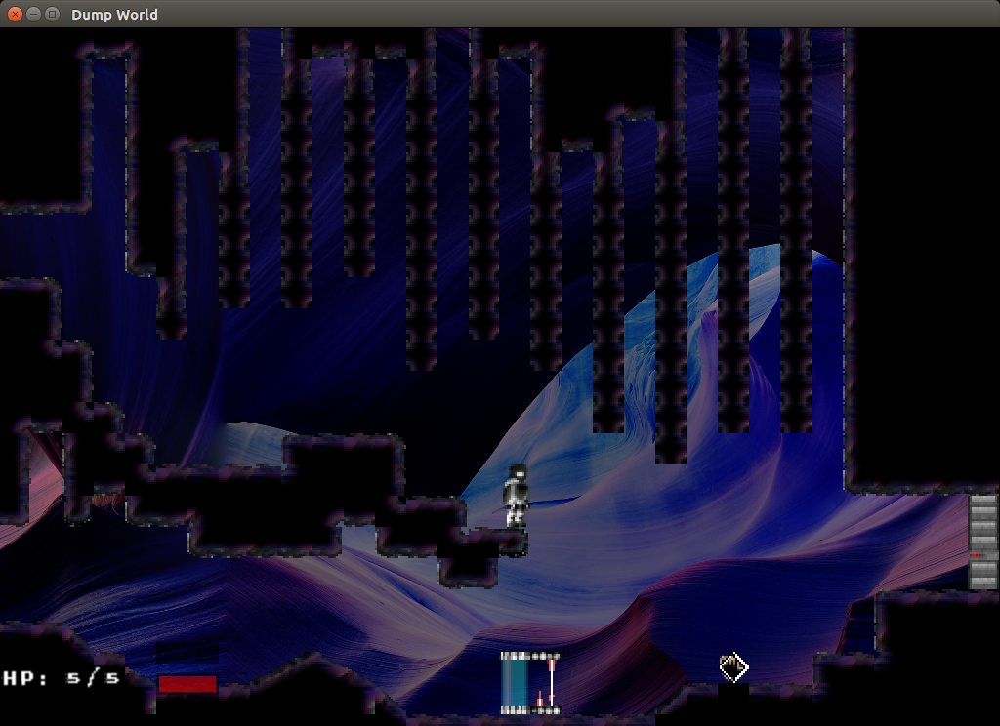
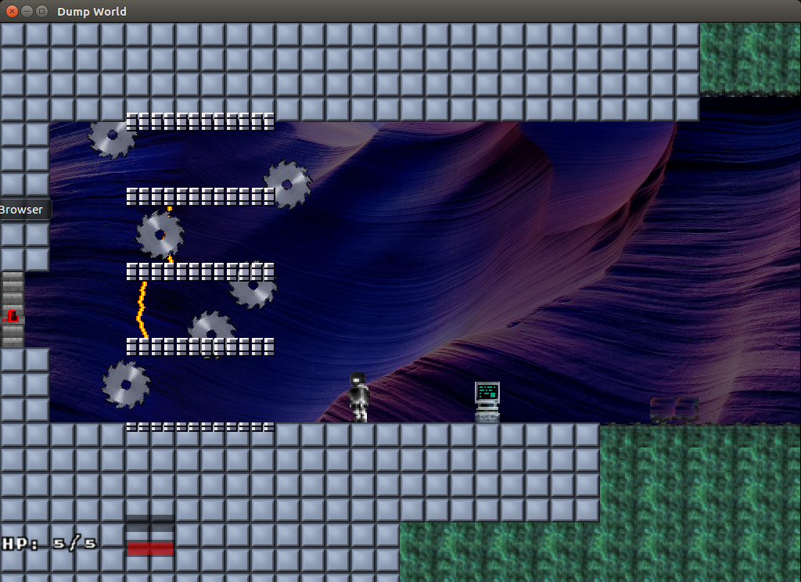
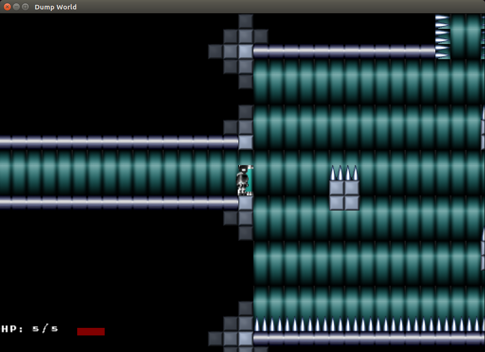
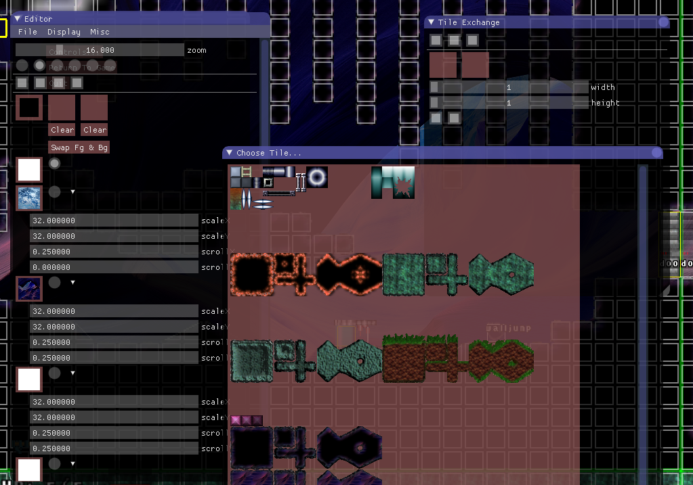
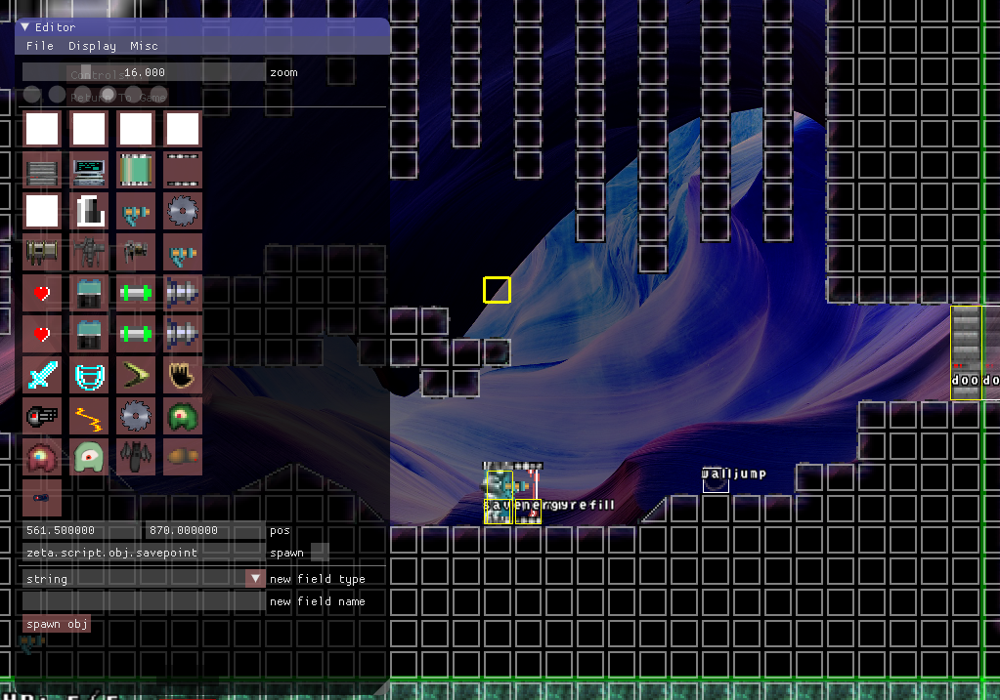

# Zeta
## A Metroidvania Game

I'm dumping a whole bunch of random stuff into a platformer engine.

### Features ###
* multiplayer split-screen and netplay (albeit very unoptimized)
* built-in editor

### Dependencies ###
* ImGuiApp Lua lib
	* cimgui + ImGui
* GLApp Lua lib
	* Malkia's UFO bindings
	* SDL
* audio Lua lib, with options for:
	* SDL_mixer
	* OpenAL
* image Lua lib, with options for:
	* SDL_image
	* pure luajit
* various other Lua libs:
	* gl
	* ext
	* template
	* vec
	* parser
	* netrefl
	* resourcecache
	* threadmanager
	* simplexnoise
	* gui
	* vec-ffi
	* lua-ffi-bindings

Uses my lua-dist project to create cross-platform distributables.
I've ported this manually to Android and Wii before, but still need to integrate the changes. 
